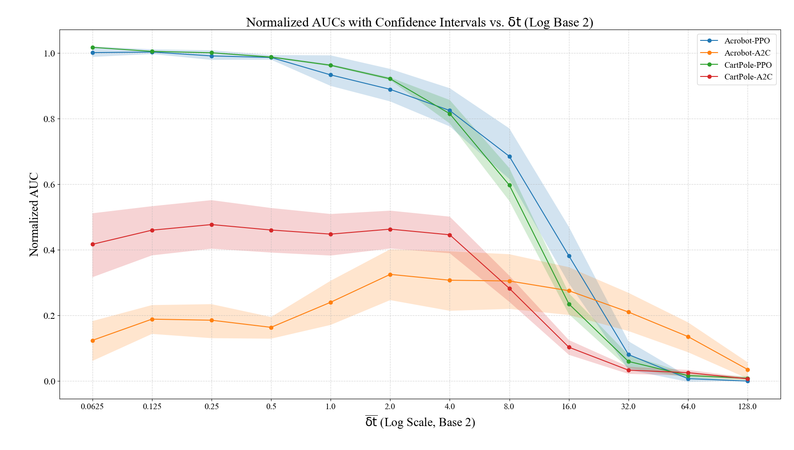
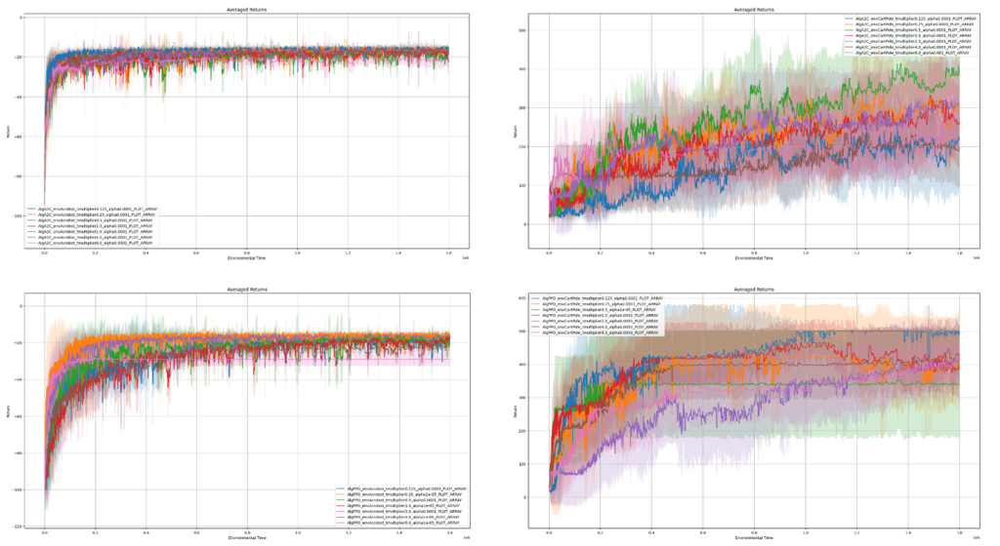

# Time Discretization in Reinforcement Learning

## Overview

This project investigates the **impact of time discretization** (`δt`) on the performance of reinforcement learning (RL) algorithms. Despite being a fundamental parameter in time-discrete simulation environments, `δt` is often overlooked and left as a default in popular benchmarks. However, we show that this choice can significantly affect training dynamics, agent behavior, and performance comparisons across algorithms.

Our work combines theoretical analysis with empirical experiments across multiple environments and algorithms, presenting one of the most comprehensive sensitivity studies on `δt` to date.

---

## Motivation

The choice of `δt` introduces a trade-off:

* **Smaller `δt`**: Finer control over the environment but higher computational cost
* **Larger `δt`**: Lower computation cost but potentially degraded control and performance

Since `δt` affects how rewards are accumulated, how often actions are taken, and how many interactions the agent gets during training, it is critical to assess whether common default values of `δt` are:

* Optimal for all algorithms
* Fair when comparing different algorithms

---

## Goals

1. Assess **how performance varies** with changes in `δt`
2. Determine whether default `δt` values in environments like **CartPole** and **Acrobot** introduce **biases**
3. Propose guidelines for **fair evaluation** and **hyperparameter tuning** across algorithms

---

## Methodology

We reframe the RL setting by explicitly integrating the time discretization factor `δt` into the MDP definition:

```
Mδt = (S, A, T_δt, r_δt, γ_δt)
```

### Key Steps:

* Rewards, discount factors, and time steps are **scaled by `δt`**
* We **normalize environmental time** across experiments to ensure fair comparison
* Use **relative δ̄t = δt / δt\_default** to abstract away environment-specific scaling
* Tune the learning rate for each configuration from a candidate pool

### Algorithms and Environments

* **Algorithms**: PPO and A2C
* **Environments**: CartPole and Acrobot

---

## Experimental Design

* Learning curves are generated for 11 values of relative `δt`
* Performance measured by **Area Under Curve (AUC)** of episodic returns
* Environmental time is fixed across experiments
* Evaluation done on 30 random seeds for final results

> **Figure Placeholder**: Sensitivity Curves of PPO and A2C on CartPole and Acrobot

---

## Results Summary

* **PPO** degrades significantly beyond `δt = 8`
* **A2C** remains stable up to `δt = 128` in Acrobot
* Moderate increases in `δt` (e.g. `δt = 2` or `4`) do **not lead to statistically significant drops**
* This indicates potential for **lower computation** without sacrificing performance


Figure 1: Sensitivity Curve of different algorithms with 30 seeds, with bootstrap confidence intervals.


Figure 2: Learning Curve in Different Environment

---

## Key Insights

* The choice of `δt` can advantage or disadvantage algorithms unfairly
* Default `δt` values may introduce **hidden bias** in benchmark comparisons
* Larger `δt` values can **save computation** with tolerable performance loss

---

## Limitations

* Computational cost limited the range of `δt` values tested
* Only two environments and two algorithms studied
* No exploration of **adaptive `δt`**, **continuous-time algorithms**, or **real-time deployment**

---

## Future Work

* Use **absolute `δt`** to enable cross-environment comparison
* Disentangle agent/environment time steps to investigate **multi-time-scale interaction**
* Study **random baselines** and **tolerance intervals** for robustness analysis
* Apply results to **RL safety**, **robot control**, or **energy-constrained settings**

---

## Conclusion

This project highlights time discretization as a **critical but overlooked factor** in RL experimentation. Through a detailed sensitivity analysis across `δt` values, we demonstrate that algorithm performance is significantly influenced by how time is discretized. These findings call for **reform in empirical RL practice**, emphasizing the need to tune and report `δt` as a standard hyperparameter in future research.

---

## Citation

If using this code or insights from this work, please cite:

```
@project{time_discretization_rl_2024,
  title={Investigating the Effect of Different Time Discretizations on the Performance of RL Algorithms},
  author={Armin Ashrafi, Masoud Jafaripour, Sarah Amini},
  year={2024},
  institution={University of Alberta; Amii},
  note={RL1 Course Project}
}
```

---

## Acknowledgements

Thanks to our mentor **Jacob Adkins** and the RL1 teaching team at the University of Alberta.

---

## Repository Structure

```
RL-Time-Discretization/
├── CC/            # Scripts and configuration files for Compute Canada execution
├── Environments/   # Custom or modified Gym environments
├── Experiments/    # Main training pipeline and experiment runners
├── Helpers/        # Utility functions and shared code
├── Others/         # Miscellaneous supporting files (e.g., configs, notes)
├── Plots/          # Saved figures, sensitivity curves, and training visualizations
├── Results/        # Aggregated result files, AUC logs, and evaluation metrics
├── .DS_Store       # macOS system file (should be ignored)
├── .gitignore      # Files and directories to exclude from Git version control
├── README.md       # Project overview (this file)
└── RL1_Project_Report.pdf   # Final project report (detailed analysis and plots)
```

---

## Questions?

We welcome feedback and questions! Feel free to reach out via email:

* [armin.ashrafi@ualberta.ca](mailto:armin.ashrafi@ualberta.ca)
* [jafaripo@ualberta.ca](mailto:jafaripo@ualberta.ca)
* [samini1@ualberta.ca](mailto:samini1@ualberta.ca)
